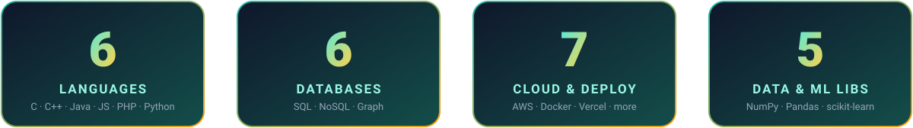
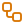
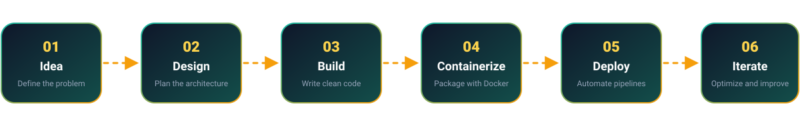
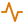

<div align="center">


<br/>

[](https://linkedin.com/in/yogesh-dandawalkar)
[](mailto:yogeshdand04@gmail.com)
[](https://github.com/yogesh0405)
[](https://instagram.com/yogeshh_1.9)


</div>


<h2 align="center">&nbsp; About Me</h2>

<table>
<tr>
<td width="55%" valign="top">

I'm a <b>Full Stack Developer</b> who enjoys turning ideas into clean, scalable products. I work across the stack, from responsive web and mobile front ends to resilient backends and data pipelines, and I'm currently going deeper into <b>cloud architecture</b> and <b>data-driven systems</b>.

I care about readable code, sensible architecture, and shipping things that actually work for users.

&nbsp; <b>What I'm looking for:</b> collaborations on high-impact software projects where I can build, learn, and ship.

</td>
<td width="45%" valign="top">

| | |
|:--|:--|
| &nbsp; <b>Role</b> | Full Stack Developer |
| &nbsp; <b>Location</b> | India (UTC +05:30) |
| &nbsp; <b>Focus</b> | Scalable web & mobile |
| &nbsp; <b>Exploring</b> | Cloud & data systems |
| &nbsp; <b>Approach</b> | Clean code & product thinking |
| &nbsp; <b>Status</b> | Open to collaborate |

</td>
</tr>
</table>

```js
const yogesh = {
  role: "Full Stack Developer",
  languages: ["C", "C++", "Java", "JavaScript", "Python", "PHP"],
  currentlyExploring: ["Cloud Architecture", "Data Pipelines", "ML Workflows"],
  databases: ["MySQL", "MongoDB", "Neo4j", "SQLite", "Supabase"],
  philosophy: "Clean code, scalable systems, product-first thinking",
  openTo: "High-impact software collaborations",
};
```


<h2 align="center">&nbsp; At a Glance</h2>




<h2 align="center">&nbsp; What I Do</h2>

<table>
<tr>
<td width="33%" valign="top" align="center">

### &nbsp; Cloud & Backend
Resilient backend systems and cloud architecture on <b>AWS</b>, <b>Firebase</b> and containerized infrastructure with <b>Docker</b>.

</td>
<td width="33%" valign="top" align="center">

### &nbsp; Data & ML
Data-driven pipelines and analytics using <b>Python, Pandas & SQL</b>, plus integrating <b>machine learning</b> workflows.

</td>
<td width="33%" valign="top" align="center">

### &nbsp; Web & Mobile
Scalable web and mobile applications built with <b>clean architecture</b> and product thinking.

</td>
</tr>
<tr>
<td width="33%" valign="top" align="center">

### &nbsp; Databases
Optimizing <b>relational and graph databases</b>: MySQL, MongoDB, Neo4j and SQL Server.

</td>
<td width="33%" valign="top" align="center">

### &nbsp; DevOps
Automating <b>deployment pipelines</b> across Vercel, Netlify and Render, with containers for consistency.

</td>
<td width="33%" valign="top" align="center">

### &nbsp; Performance
High-performance code in <b>C++, Java, JavaScript & Python</b>, with system optimization best practices.

</td>
</tr>
</table>


<h2 align="center">&nbsp; How I Build</h2>




<h2 align="center">&nbsp; Tech Stack</h2>

<table>
<tr>
<td width="20%" align="right" valign="middle"><b>&nbsp; Languages</b></td>
<td>


</td>
</tr>
<tr>
<td align="right" valign="middle"><b>&nbsp; Web</b></td>
<td>


</td>
</tr>
<tr>
<td align="right" valign="middle"><b>&nbsp; Cloud & Deploy</b></td>
<td>


</td>
</tr>
<tr>
<td align="right" valign="middle"><b>&nbsp; Databases</b></td>
<td>


</td>
</tr>
<tr>
<td align="right" valign="middle"><b>&nbsp; Data & ML</b></td>
<td>


</td>
</tr>
<tr>
<td align="right" valign="middle"><b>&nbsp; Design</b></td>
<td>


</td>
</tr>
<tr>
<td align="right" valign="middle"><b>&nbsp; Tools</b></td>
<td>


</td>
</tr>
</table>


<h2 align="center">&nbsp; Featured Projects</h2>

<table>
<tr>
<td width="50%" valign="top">

### &nbsp; PlogMate

A companion app for plogging, combining jogging with picking up litter, built to make eco-friendly fitness easy and social.

[](https://github.com/yogesh0405/PlogMate)

</td>
<td width="50%" valign="top">

### &nbsp; YogQrra

A QR-focused project that explores generating and using QR codes in a clean, simple application.

[](https://github.com/yogesh0405/YogQrra)

</td>
</tr>
</table>


<h2 align="center">&nbsp; GitHub Stats</h2>

<!--STATS:START-->
<table width="100%">
<thead>
<tr>
<th width="33%" align="center">&nbsp; TOTAL COMMITS</th>
<th width="33%" align="center">&nbsp; CURRENT STREAK</th>
<th width="33%" align="center">&nbsp; LONGEST STREAK</th>
</tr>
</thead>
<tbody>
<tr>
<td align="center"><h1>431</h1><b>commits</b><br/><sub>public repositories since Sep 2025</sub></td>
<td align="center"><h1>10</h1><b>days</b><br/><sub>Sep 29 - Oct 8</sub></td>
<td align="center"><h1>17</h1><b>days</b><br/><sub>Aug 24 - Sep 9</sub></td>
</tr>
<tr>
<td align="center"><code>▰▰▰▰▰▰▰▰▰▰▱▱</code><br/><sub>86% of the way to 500 commits</sub></td>
<td align="center"><code>▰▰▰▰▰▰▰▱▱▱▱▱</code><br/><sub>59% of personal best</sub></td>
<td align="center"><code>▰▰▰▰▰▰▰▰▰▰▰▰</code><br/><sub>personal best</sub></td>
</tr>
<tr>
<td colspan="3" align="center"><sub><b>LAST 30 DAYS</b> &nbsp;|&nbsp; 178 contributions on 26 active days</sub><br/><code>▂▁▄▂▂▂▁▂▂▁▂▂▄▅▂▆▂█▅▁▂▂▃▂▄▅▂▃▂▂</code></td>
</tr>
</tbody>
</table>

<p align="center">


</p>

<p align="center"><sub>Auto-updated on Oct 8, 2026</sub></p>
<!--STATS:END-->


<h2 align="center">&nbsp; How I Work</h2>

<table>
<tr>
<td width="25%" align="center" valign="top">


<br/>
<b>Clean Code</b>
<br/>
Readable, maintainable and well structured

</td>
<td width="25%" align="center" valign="top">


<br/>
<b>Scalability</b>
<br/>
Systems designed to grow with users

</td>
<td width="25%" align="center" valign="top">


<br/>
<b>Automation</b>
<br/>
Pipelines that remove repetitive work

</td>
<td width="25%" align="center" valign="top">


<br/>
<b>Product Thinking</b>
<br/>
Building what people actually need

</td>
</tr>
</table>


<h2 align="center">&nbsp; Let's Connect</h2>

<div align="center">

I'm always open to interesting conversations, collaborations and opportunities.
<br/>
If you have an idea worth building, let's talk.

<br/>

[](https://linkedin.com/in/yogesh-dandawalkar)
[](mailto:yogeshdand04@gmail.com)
[](https://github.com/yogesh0405)
[](https://instagram.com/yogeshh_1.9)

<br/>


</div>